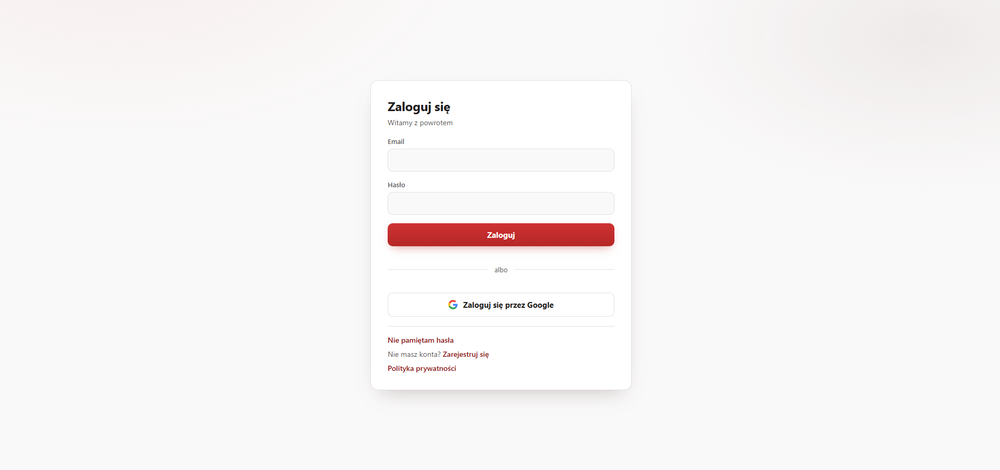
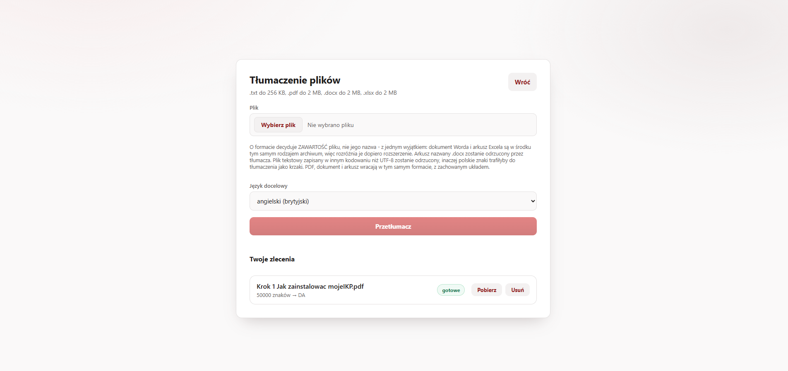
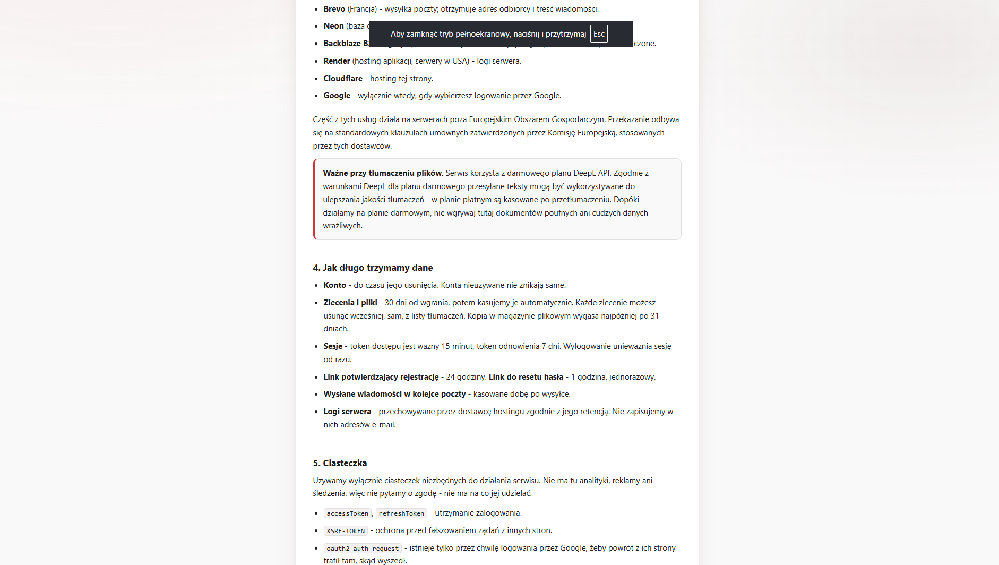

# File Translator API

[](https://github.com/Robert-m18/File-translator/actions/workflows/ci.yml)
[](https://openjdk.org/projects/jdk/21/)
[](https://spring.io/projects/spring-boot)
[](https://www.postgresql.org/)

Backend REST API w Spring Boot 4 / Java 21 — usługa tłumaczenia plików (`.txt`, PDF, DOCX, XLSX)
z kompletnym uwierzytelnianiem i panelem administracyjnym.

- **Tłumaczenie** — upload, kolejka zadań w bazie, worker w tle, deduplikacja po odcisku treści,
  pliki w magazynie obiektowym (S3/MinIO), powiadomienie mailem.
- **Uwierzytelnianie** — rejestracja z potwierdzeniem adresu, logowanie na ciasteczkach `httpOnly`,
  logowanie kontem Google (OAuth2/OIDC), rotacja tokenów odświeżających z wykrywaniem kradzieży,
  blokada konta, reset hasła.
- **Panel administracyjny** — lista i wyszukiwanie kont, blokowanie z powodem, zdejmowanie blokady
  logowania, wymuszone wylogowanie, usunięcie konta razem z jego plikami.

Interfejs (React + Vite) jest osobnym repozytorium:
**[File_translator_frontend_REACT](https://github.com/Robert-m18/File_translator_frontend_REACT)**.

> Nazwa artefaktu Mavena (`file_translator`) została z pierwotnego szkieletu projektu.

---

## Demo

**Aplikacja działa pod adresem: https://file-translator-frontend-react.rmoczygeba11.workers.dev**

Konto testowe, żeby nie zakładać własnego:

| | |
|---|---|
| Login | `rmoczygeba11+demo@gmail.com` |
| Hasło | `DemoFileTranslator1` |

> **Pierwsze wejście może potrwać do ~3 minut.** Backend stoi na darmowej instancji Rendera,
> która usypia po okresie bezczynności i budzi się dopiero przy pierwszym żądaniu. Objawem jest
> komunikat o błędzie serwera przy logowaniu — wystarczy odczekać i spróbować ponownie.
> Kolejne żądania są już natychmiastowe.

| Usługa | Gdzie stoi |
|---|---|
| Frontend | Cloudflare Workers |
| Backend | Render (plan darmowy, Wirginia) |
| Baza | Neon (PostgreSQL, AWS US East) |
| Pliki | Backblaze B2 (S3-compatible, EU Central) |
| Poczta | Brevo (SMTP) |

---

## Zrzuty ekranu

| Logowanie | Pulpit |
|---|---|
|  |  |
| Logowanie hasłem albo kontem Google. | Dane sesji z `GET /auth/me` — jedynego źródła prawdy o zalogowaniu. |

| Tłumaczenie plików | Polityka prywatności |
|---|---|
|  |  |
| Upload, wybór języka i lista własnych zleceń z ich statusem. | Konkretne terminy retencji i lista podprzetwarzających. |

---

## Stack

| Warstwa | Technologia |
|---|---|
| Runtime | Java 21, Spring Boot 4.0.6 |
| Bezpieczeństwo | Spring Security 7, JWT (jjwt), BCrypt |
| Persystencja | Spring Data JPA / Hibernate, PostgreSQL 17 |
| Pliki | magazyn obiektowy — AWS SDK v2 (S3), lokalnie MinIO |
| Migracje | Liquibase (XML) |
| Mapowanie DTO | ręczne — MapStruct usunięty, obsługiwał jeden mapper do nieistniejącego już CRUD-u |
| Dokumentacja | springdoc-openapi 3 (OpenAPI 3 + Swagger UI) |
| Obserwowalność | Spring Boot Actuator, Micrometer + Prometheus |
| Ochrona przed nadużyciami | bucket4j (token bucket), Caffeine lub Redis |
| Poczta | Spring Mail + Thymeleaf, transakcyjna skrzynka nadawcza (outbox) |
| Testy | JUnit 5, Mockito, MockMvc, Testcontainers (H2 jako wariant `-Ph2`), JaCoCo |

---

## Szybki start

### Docker Compose (zalecane)

Podnosi PostgreSQL, Redis, magazyn obiektowy (MinIO), lokalny serwer SMTP i aplikację:

```bash
docker compose up -d
```

| Co | Gdzie |
|---|---|
| API | http://localhost:2009 |
| Swagger UI | http://localhost:2009/swagger-ui.html |
| Health check | http://localhost:2009/actuator/health |
| Skrzynka pocztowa (Mailpit) | http://localhost:8025 |
| Magazyn plików (MinIO) | http://localhost:9001, `minioadmin`/`minioadmin` |
| Baza (DBeaver/psql) | `localhost:5433`, baza `userapitest`, `postgres`/`postgres` |

Domyślnie wstaje z atrapą tłumacza (`echo`), więc działa bez konta u dostawcy. Prawdziwe
tłumaczenie: patrz sekcja *Tłumaczenie plików*.

Maile weryfikacyjne nie wychodzą na zewnątrz — lądują w Mailpicie pod adresem powyżej.

**Port bazy to 5433, nie 5432.** Domyślny port zostawiamy wolny, bo na maszynach
deweloperskich stoi tam zwykle lokalnie zainstalowany PostgreSQL — zajęcie go albo wywala
`docker compose up`, albo cicho podłącza narzędzia do cudzego serwera.

### Uruchomienie lokalne

Wymaga bazy z Compose'a (`docker compose up -d postgres`). Konfiguracja domyślna celuje
w `localhost:5433` i w Mailpita na `localhost:1025`, więc nie trzeba ustawiać niczego:

```bash
./mvnw spring-boot:run
```

Schemat bazy tworzy Liquibase przy starcie. Hibernate działa w trybie `validate`
i **nie** modyfikuje schematu.

### Testy

```bash
./mvnw test                    # wszystkie testy (PostgreSQL, Redis i MinIO w kontenerach)
./mvnw verify                  # testy + raport pokrycia (target/site/jacoco/index.html)
./mvnw test -Ph2               # szybka pętla na H2, bez Dockera
./mvnw test -Dtest=AuthServiceTest
./mvnw test -Dtest=AuthServiceTest#login_shouldReturnTokenPair
```

Domyślny przebieg wymaga **działającego Dockera**: `TestInfrastructure` podnosi
przez Testcontainers PostgreSQL-a, Redisa i MinIO — te same obrazy co w `docker-compose.yml`
— raz na cały przebieg i wskazuje na nie konfigurację. Schemat budują te same migracje
Liquibase co na produkcji (Hibernate w trybie `validate`), więc `mvn test` wykrywa rozjazd
encji z migracjami *na docelowym silniku*, a nie na jego namiastce.

`-Ph2` zostawia stary wariant — H2 w pamięci w trybie zgodności `MODE=PostgreSQL` — na
szybkie pętle bez Dockera. **Zielone `-Ph2` nie jest obietnicą zielonego CI**: H2 nie
odwzorowuje wiernie ani składni `FOR NO KEY UPDATE ... SKIP LOCKED`, ani zachowania
migracji, a `RedisBucketProvider` i `S3ObjectStore` w ogóle się na nim nie wykonują.
`TestInfrastructureTest` pilnuje, żeby wariant nie zamienił się po cichu w ten drugi.

---

## Architektura

### Organizacja pakietów — decyzja i uzasadnienie

Kod jest podzielony **według funkcjonalności** (package-by-feature), a nie według warstw
technicznych (`controllers/`, `services/`, `repositories/`):

```
com.example.filetranslator
├── auth/            logowanie, sesje, rotacja tokenów, blokada konta, rejestracja
│   ├── dto/  model/  repository/  oauth2/     (oauth2/ = logowanie kontem Google)
├── user/            konto użytkownika, encja User (auth zależy od user, nigdy odwrotnie)
│   ├── dto/  model/
├── admin/           panel: lista i wyszukiwanie kont, blokada, wymuszone wylogowanie,
│                   usunięcie konta razem z plikami
│   ├── dto/  exception/
├── translation/     tłumaczenie: upload, kolejka, worker, dostawca, magazyn obiektowy
│   ├── dto/  model/  repository/  exception/  provider/  storage/
├── notification/    wysyłka maili transakcyjnych (skrzynka nadawcza)
└── common/          wspólna infrastruktura
    ├── config/         konfiguracja Springa (bezpieczeństwo, OpenAPI)
    ├── security/       JWT, ciasteczka, limity żądań, punkty wejścia Spring Security
    │   └── ratelimit/  wymienny magazyn limitów (pamięć / Redis)
    ├── web/            format błędów (RFC 9457), odpowiedzi sukcesu
    ├── exception/      wyjątki dziedzinowe
    ├── observability/  korelacja żądań
    ├── time/           obcinanie znaczników do precyzji kolumny
    └── validation/     własne adnotacje walidacyjne
```

`admin/` stoi **nad** `user/` i `auth/`, a nie w którymś z nich: blokada konta musi unieważnić
sesje, czyli sięgnąć do `auth/`, więc umieszczenie panelu w `user/` odwróciłoby kierunek
zależności `auth → user` w cykl.

**Dlaczego tak:**

* **Zmiany chodzą wzdłuż funkcjonalności, nie wzdłuż warstw.** Dodanie logowania przez Google
  dotyka kontrolera, serwisu, encji i repozytorium — czyli w układzie warstwowym czterech
  różnych katalogów naraz. Tutaj to praca w jednym.
* **Granice są widoczne w kompilatorze.** Zależność `auth → user` jest jednokierunkowa i widać
  ją w importach. W układzie warstwowym wszystko leży w `services/` i nic nie sygnalizuje,
  że coś sięga tam, gdzie nie powinno.
* **Skalowanie projektu.** Docelowy moduł tłumaczenia plików to kilkanaście klas. W układzie
  warstwowym rozsypałyby się po tych samych czterech katalogach, wymieszane z uwierzytelnianiem.
  Tutaj to osobny pakiet, który nie dotyka `auth/` w ogóle.
* **`common/` jest świadomie wąskie.** Trafia tam wyłącznie infrastruktura bez wiedzy
  o dziedzinie. Gdyby zaczęło puchnąć o logikę biznesową, byłby to sygnał, że powstaje
  nowa funkcjonalność, a nie kolejny worek na wszystko.

**Czego tu celowo nie ma:** architektury heksagonalnej ani podziału na moduły Mavena.
Przy jednym module i takiej wielkości projektu byłby to koszt bez zwrotu — port i adapter
dla każdego repozytorium dokładają warstwę pośrednią, nie usuwając żadnego realnego problemu.
Package-by-feature to naturalny krok przed tym podziałem i wystarczający punkt zatrzymania.

Konsekwencją tej zmiany było też usunięcie interfejsów `*ServiceInterface` z jedną
implementacją. Interfejs ma sens, gdy istnieje druga implementacja albo gdy trzeba odwrócić
kierunek zależności — inaczej dokłada plik do utrzymania i nic nie wnosi (Mockito i Spring
radzą sobie z klasami konkretnymi). Interfejsy zostały tam, gdzie realnie istnieje wybór
implementacji, jak `BucketProvider`.

### Przepływ uwierzytelnionego żądania

```
Request
  → TraceIdFilter          (nadaje X-Request-Id, wkłada traceId do MDC)
  → CORS / SecurityFilterChain
  → JwtFilter              (czyta ciasteczko accessToken, waliduje, ustawia SecurityContext)
  → AuthorizationFilter     (reguły dostępu wg ścieżki)
  → Controller → Service → Repository
```

Błędy:

* wewnątrz kontrolerów i serwisów → `GlobalExceptionHandler` (`@RestControllerAdvice`)
* wewnątrz filtrów → `ProblemResponseWriter` (advice tam nie sięga — filtry
  działają przed `DispatcherServlet`)
* brak uwierzytelnienia / brak uprawnień → `RestAuthenticationEntryPoint` / `RestAccessDeniedHandler`

Wszystkie trzy ścieżki zwracają ten sam format.

### Tokeny w ciasteczkach, nie w nagłówku

`AuthController` nigdy nie zwraca tokenu w ciele odpowiedzi. `CookieService` wystawia:

| Ciasteczko | Ważność | Ścieżka | Atrybuty |
|---|---|---|---|
| `accessToken` | 15 min | `/` | httpOnly, secure\*, SameSite\* |
| `refreshToken` | 7 dni | `/auth` | httpOnly, secure\*, SameSite\* |

\* z konfiguracji (`app.cookie.*`) — na dev `secure: false`, bo localhost działa po HTTP.

`httpOnly` sprawia, że JavaScript nie odczyta tokenu, co odcina najprostszą ścieżkę
kradzieży sesji przez XSS. Ścieżka `refreshToken` jest zawężona, więc token odświeżający
nie jest wysyłany przy każdym żądaniu do API.

Access i refresh rozróżnia claim `type` (`access` / `refresh`), sprawdzany w `AuthService.refreshToken`.
Każdy token ma losowy `jti`, więc dwa tokeny wydane w tej samej sekundzie nigdy nie są identyczne.

### Logowanie kontem Google — nasza sesja, nie cudza

Przepływ jest **serwerowy** (authorization code): SPA robi zwykłą nawigację pod
`/oauth2/authorization/google`, Google odsyła przeglądarkę na `/login/oauth2/code/google`,
a aplikacja wystawia **te same ciasteczka**, co `POST /auth/login`, i przekierowuje z powrotem
na front. Sekret klienta nigdy nie opuszcza backendu, a front nie potrzebuje żadnego SDK Google —
to jeden przycisk zmieniający `window.location`.

**`OidcUser` nie zostaje zasadą uwierzytelnienia aplikacji.** Żyje wyłącznie przez czas obsługi
powrotu z Google i zamienia się na naszą parę tokenów, zanim przeglądarka wróci na front. Dzięki
temu `JwtFilter`, `GET /auth/me`, rotacja tokenów, wykrywanie kradzieży i wylogowanie działają dla
konta Google bez ani jednej linijki napisanej osobno — i bez wydzielania zasady uwierzytelnienia
z encji `User`.

**Łączenie kont odbywa się po potwierdzonym adresie.** Google z `email_verified = true` dowodzi
kontroli nad tą samą skrzynką, co kliknięcie w link potwierdzający przy rejestracji, więc konto
założone hasłem i logowanie Google na ten sam adres to jedno konto — dopisujemy tylko `google_sub`.
**Bez potwierdzonego adresu odmawiamy zawsze**: inaczej wystarczyłoby założyć konto Google na cudzy
adres, żeby przejąć cudze konto. Tożsamością jest od tej chwili `sub`, a nie adres — adres w koncie
Google można zmienić.

**Blokada administracyjna jest sprawdzana osobno na tej ścieżce, bo OAuth2 omija
`DaoAuthenticationProvider`** (a więc i `BlockedAccountChecker`). Bez tego zablokowany użytkownik
dostawałby `423` przy logowaniu hasłem i wchodził bokiem przez Google. Sprawdzane jest `isBlocked()`,
a **nie** `isAccountNonLocked()` — ta druga obejmuje też blokadę po nieudanych logowaniach, którą
wywołać może każdy na każdym, więc byłaby gotowym narzędziem do odcinania dowolnego użytkownika
od logowania Google.

**Żądanie autoryzacyjne leży w ciasteczku, nie w sesji** — łańcuch jest bezsesyjny, więc domyślne
repozytorium nie miałoby gdzie go odłożyć. Ciasteczko ma `SameSite=Lax` **przypięte na sztywno**:
powrót z `accounts.google.com` to nawigacja międzywitrynowa, a przy `Strict` z profilu bazowego
przeglądarka po prostu by go nie odesłała.

Bez `GOOGLE_CLIENT_ID`/`GOOGLE_CLIENT_SECRET` cała ta gałąź jest **wyłączona**, a aplikacja mówi
o tym `WARN`-em przy starcie — rejestracja i logowanie hasłem działają bez niej. Adres powrotny
trzeba wpisać w Google Cloud Console co do znaku (`http://localhost:2009/login/oauth2/code/google`
dla uruchomienia lokalnego); niezgodność odbija się po stronie Google i nie zostawia śladu
w naszych logach.

### Sesje: rotacja tokenów z wykrywaniem kradzieży

Access token pozostaje bezstanowy (15 min), ale każdy token odświeżający ma odpowiadający
mu rekord w tabeli `refresh_tokens` — dopiero to pozwala unieważnić sesję przed jej wygaśnięciem.

* **Rotacja** — każde `/auth/refresh` zużywa przedstawiony token i wydaje nowy. Token działa raz.
* **Rodzina** — wszystkie tokeny z kolejnych rotacji jednej sesji dzielą `family_id`.
* **Wykrycie ponownego użycia** — próba użycia tokenu już zużytego oznacza, że istnieje jego
  kopia. Nie da się rozstrzygnąć, kto jest prawowitym właścicielem, więc unieważniana jest
  **cała rodzina** i obie strony muszą zalogować się ponownie.
* **Wylogowanie** — unieważnia rodzinę, czyli sesję danego urządzenia. Sesje na innych
  urządzeniach zostają nietknięte.

W bazie leży wyłącznie SHA-256 tokenu (`TokenHasher`) — wyciek dumpu nie daje działających sesji.

### Ochrona przed atakiem siłowym — dwie niezależne warstwy

| Mechanizm | Chroni | Klucz | Reakcja |
|---|---|---|---|
| Limit żądań (`RateLimitFilter`, bucket4j) | serwer i pozostałych użytkowników | adres IP + ścieżka | 429 + `Retry-After` |
| Blokada konta (`LoginAttemptService`) | konkretne konto | adres email | 423 po 5 nieudanych próbach, na 15 min |

Rozdzielenie jest celowe: limit per IP nie chroni konta przed atakiem rozproszonym,
a blokada konta nie chroni serwera przed zalewem żądań na tysiąc różnych kont.

Filtr limitujący stoi **wewnątrz** łańcucha Spring Security, zaraz za `CorsFilter` — i to
konkretne miejsce jest naprawą błędu, nie porządkami. Wcześniej działał przed całym łańcuchem,
czyli przed CORS-em, więc odpowiedź `429` wychodziła **bez** nagłówka
`Access-Control-Allow-Origin`. Przeglądarka taką odpowiedź blokuje, więc SPA na innym adresie
nigdy nie dostawało komunikatu „spróbuj za N s" — `fetch` rzucał błąd sieci, nie do odróżnienia
od martwego serwera. Ciało odpowiedzi było poprawne od początku, po prostu nie docierało.
Test sprawdzający sam status `429` przechodził w obu wariantach; regresja
(`RateLimitTest.rateLimited429_shouldCarryCorsHeaders`) sprawdza **nagłówek**.

Ograniczanie dalej dzieje się przed CSRF, przed jakimkolwiek zapytaniem do bazy i przed
porównaniem hasha BCrypt — `CorsFilter` jest tani. Świadomie przyjęta konsekwencja: żądania
odrzucone przez CSRF też zużywają żetony z kubełka.

**Magazyn limitów jest wymienny** (`app.rate-limit.store`):

| Wartość | Zachowanie | Kiedy |
|---|---|---|
| `memory` (domyślnie) | kubełki w pamięci procesu (Caffeine) | jedna instancja aplikacji |
| `redis` | kubełki w Redisie, operacje compare-and-swap | wiele instancji za load balancerem |

Wybór robi `BucketProvider` — `RateLimitFilter` nie wie, która implementacja jest wstrzyknięta.

Powód istnienia obu: przy trzech instancjach z magazynem w pamięci każda liczy własne kubełki,
więc limit „10 na minutę" staje się faktycznie 30 na minutę. Redis to naprawia, ale dokłada
zależność sieciową na ścieżce **każdego** żądania do `/auth/**` i kolejny punkt awarii —
dlatego nie jest wartością domyślną. Redis nie jest też wymagany do startu aplikacji,
dopóki `store` ma wartość `memory`.

### Rejestracja — przez tabelę poczekalni, z transakcyjną skrzynką nadawczą

1. `AuthService.register` — **nie tworzy** wiersza w `users`. Zapisuje `PendingRegistration`
   (adres, imię, hash BCrypt hasła, **SHA-256** losowego UUID, ważność 24 h) i zamawia maila
   przez `MailOutbox`, czyli wierszem w `outbox_messages` **w tej samej transakcji**.
2. `OutboxPublisher` — `@Scheduled`, rezerwuje paczkę (`FOR UPDATE SKIP LOCKED`) i wysyła
   równolegle, z ponowieniami i wykładniczym odstępem.
3. `AuthService.confirmEmail` — wyszukanie po hashu, sprawdzenie ważności, utworzenie konta
   przez `UserService.createConfirmedUser` od razu z `enabled = true`.
4. `ExpiredTokenCleanupJob` / `OutboxCleanupJob` — nocne czyszczenie wygasłych zgłoszeń
   i wysłanych maili.

Trzy rzeczy są tu nośne:

* **Wiersz `users` z `enabled=false` jest stanem niemożliwym.** Wcześniej rejestracja tworzyła
  konto wyłączone i nadpisywała je przy ponownej próbie — obcy mógł więc podmienić hasło
  cudzej rejestracji w toku, a ofiara, klikając najnowszy link **we własnej skrzynce**,
  aktywowała konto z hasłem napastnika. Dlatego `pending_registrations.email` celowo **nie jest
  unikatem**: równoległe zgłoszenia na jeden adres to poprawny stan, a potwierdzenie aktywuje
  dokładnie to, którego token był w klikniętym linku.
* **Skrzynka nadawcza zamiast zdarzenia w pamięci.** Poprzednia wersja
  (`@TransactionalEventListener(AFTER_COMMIT)` + `@Async`) też nie wysyłała maili z wycofanych
  transakcji, ale zamiar istniał wyłącznie w pamięci procesu — awaria SMTP albo restart między
  zatwierdzeniem a wysyłką kasowały go bez śladu. Cena: dostarczenie jest **co najmniej raz**.
* **W bazie nie ma surowego tokenu** — wyciek dumpu nie pozwala aktywować cudzego konta.

Rejestracja **nigdy nie zdradza, czy adres jest zajęty**: odpowiedź to zawsze `202`, a właściciel
zajętego adresu dostaje maila „konto już istnieje" zamiast napastnika dostać `409`.

### Format błędów — RFC 9457

Każdy błąd to `application/problem+json`:

```json
{
  "type": "https://filetranslator.dev/problems/validation-failed",
  "title": "Błąd walidacji",
  "status": 400,
  "detail": "Żądanie zawiera nieprawidłowe dane",
  "code": "VALIDATION_FAILED",
  "timestamp": "2026-07-25T10:15:30.123Z",
  "traceId": "a1b2c3d4e5f60718",
  "errors": [
    { "field": "password", "message": "Hasło musi mieć od 8 do 72 znaków" }
  ]
}
```

* `code` — stabilny kod maszynowy; frontend reaguje na niego, a nie na tekst komunikatu
* `traceId` — spina odpowiedź z logami serwera (ten sam identyfikator wraca w nagłówku `X-Request-Id`)

---

## Endpointy

| Metoda | Ścieżka | Dostęp | Opis |
|---|---|---|---|
| GET | `/auth/csrf` | publiczny | Token CSRF w **ciele** odpowiedzi (ciasteczko jest `httpOnly`) |
| POST | `/auth/register` | publiczny | Rejestracja — zawsze `202`, nigdy nie zdradza, czy adres jest zajęty |
| POST | `/auth/confirm` | publiczny | Potwierdzenie adresu i utworzenie konta |
| POST | `/auth/login` | publiczny | Logowanie, ustawia ciasteczka `accessToken` i `refreshToken` |
| GET | `/auth/me` | **zalogowany** | Dane bieżącego użytkownika — jedyne źródło prawdy o stanie sesji |
| POST | `/auth/refresh` | refresh token | Rotacja tokenów z wykrywaniem ponownego użycia |
| POST | `/auth/logout` | publiczny | Unieważnia rodzinę tokenów i czyści ciasteczka |
| POST | `/auth/forgot-password` | publiczny | Wysyła link resetu — identyczna odpowiedź dla adresu znanego i nieznanego |
| POST | `/auth/reset-password` | token z maila | Ustawia nowe hasło, unieważnia wszystkie sesje |
| GET | `/oauth2/authorization/google` | publiczny | Start logowania kontem Google (nawigacja przeglądarki, **nie** `fetch`) |
| GET | `/login/oauth2/code/google` | publiczny | Adres powrotny od Google — wystawia te same ciasteczka co `/auth/login` |
| POST | `/translations` | **zalogowany** | Zlecenie tłumaczenia (`.txt`, PDF, DOCX, XLSX; `multipart/form-data`) — `202` z identyfikatorem |
| GET | `/translations` | **zalogowany** | Lista **własnych** zleceń, stronicowana, bez treści plików |
| GET | `/translations/{id}` | **właściciel** | Status zlecenia |
| GET | `/translations/{id}/content` | **właściciel** | Przetłumaczony plik (`Content-Disposition: attachment`) |
| DELETE | `/translations/{id}` | **właściciel** | Usuwa zlecenie razem z plikami |
| GET | `/users?q=&page=&size=` | `ROLE_ADMIN` | Lista kont z wyszukiwaniem po adresie i imieniu |
| GET | `/users/{id}` | `ROLE_ADMIN` | Pojedyncze konto |
| POST | `/users/{id}/block` | `ROLE_ADMIN` | Blokada konta — powód **wymagany**, sesje unieważniane |
| POST | `/users/{id}/unblock` | `ROLE_ADMIN` | Zdjęcie blokady |
| POST | `/users/{id}/unlock` | `ROLE_ADMIN` | Wyzerowanie licznika nieudanych logowań |
| POST | `/users/{id}/logout` | `ROLE_ADMIN` | Wymuszone wylogowanie ze wszystkich urządzeń |
| DELETE | `/users/{id}` | `ROLE_ADMIN` | Usuwa konto razem z sesjami, zleceniami i plikami — **nieodwracalne** |
| GET | `/actuator/health`, `/actuator/info` | publiczny | Health check i probe'y dla orkiestratora |
| GET | `/actuator/metrics`, `/actuator/prometheus` | `ROLE_ADMIN` | Metryki |

Pełna specyfikacja: `/swagger-ui.html` (wyłączone na profilu `prod`).

**Panel administracyjny stoi pod `/users`, a nie pod `/admin/users`, i to jest decyzja.** Reguła
`/users/** → ROLE_ADMIN` siedziała w `SecurityConfig` od czasu usunięcia starego CRUD-u —
właśnie po to, żeby przyszły kontroler był chroniony od pierwszego commitu. Zamapowanie panelu
gdziekolwiek indziej wymaga nowego dopasowania, a do czasu, aż ktoś je dopisze, panel wpada pod
`anyRequest().authenticated()`, czyli jest otwarty dla **każdego zalogowanego**. Adres w
przeglądarce (`/admin/users`) to trasa SPA i nie ma z tym nic wspólnego.

### Tłumaczenie plików

Przetwarzanie jest **asynchroniczne**: `POST /translations` zapisuje zlecenie i odpowiada `202`,
a tłumaczy je worker w tle. Klient odpytuje `GET /translations/{id}`, aż status przestanie być
`PENDING`/`PROCESSING`. Po zakończeniu właściciel dostaje maila (bez treści tłumaczenia).

```bash
# 1. zlecenie (potrzebne ciasteczka z logowania i nagłówek CSRF)
curl -b jar -H "X-XSRF-TOKEN: $TOKEN" \
     -F "file=@lista.txt" -F "targetLang=EN_GB" \
     http://localhost:2009/translations

# 2. status  ->  {"status":"DONE", ...}
curl -b jar http://localhost:2009/translations/1

# 3. pobranie wyniku jako plik
curl -b jar -OJ http://localhost:2009/translations/1/content
```

| Ograniczenie | Wartość | Skąd się bierze |
|---|---|---|
| Rozmiar `.txt` | 256 KB | darmowy próg DeepL to 500 tys. znaków **miesięcznie na konto** — plik 1 MB wyczerpałby go dwukrotnie |
| Rozmiar PDF / XLSX | 2 MB | liczby znaków w dokumencie nie da się poznać przed wysłaniem, więc limit ogranicza **szkodę**, a nie budżet |
| Format | `.txt` (UTF-8), PDF, XLSX | rozpoznawany po **zawartości** (`%PDF-`, sygnatura ZIP), nie po rozszerzeniu ani po `Content-Type` od klienta |
| Znaki na dobę | 50 000 na użytkownika | limit dostawcy liczy się dla całego konta, więc jedna osoba mogłaby odciąć wszystkie pozostałe |
| Żądań `POST` | 30/h z adresu IP | reguła limitera zawężona do metody — odpytywanie o status jest darmowe i nie zużywa puli |
| Retencja | 30 dni od zlecenia | to są **pliki użytkowników**; `DELETE` pozwala usunąć je wcześniej |

Pliki leżą w magazynie obiektowym (MinIO lokalnie, S3 na produkcji), a w bazie zostaje sam
**klucz** obiektu — nigdy URL, bo URL niesie kubełek, region i schemat, czyli wszystko, co się
zmienia przy zmianie dostawcy. Pobranie idzie przez API, nie przez podpisany link: właściciela
rozstrzyga warunek `user_id` w zapytaniu, przez który cudze zlecenie zwraca **404, nie 403**
(403 potwierdzałoby, że takie id istnieje, a identyfikatory są sekwencyjne).

Ten sam plik zlecony drugi raz **nie jest tłumaczony ponownie** — decyduje SHA-256 treści plus
język docelowy i dostawca. Zakres jest **per użytkownik**: cache globalny byłby oszczędniejszy,
ale natychmiastowe `DONE` zdradzałoby, że ktoś inny ma dokładnie ten plik.

**Dostawca tłumaczenia jest wymienny** (`app.translation.provider`):

| Wartość | Co robi | Kiedy |
|---|---|---|
| `echo` (domyślnie) | oznacza każdą linię kodem języka, nic nie wysyła na zewnątrz | testy, CI, `docker compose` bez konta u dostawcy |
| `deepl` | prawdziwe tłumaczenie przez DeepL API | wymaga `DEEPL_API_KEY` |

```bash
TRANSLATION_PROVIDER=deepl DEEPL_API_KEY=xxx docker compose up -d
```

Konta **darmowe** używają hosta `api-free.deepl.com`, płatne `api.deepl.com` — pomyłka kończy
się odpowiedzią `403`, która wygląda jak nieprawidłowy klucz.

### Dostęp administracyjny

Endpointy z kolumną `ROLE_ADMIN` wymagają konta z tą rolą, a rejestracja zakłada wyłącznie
konta `USER`. Jedyną drogą do roli administratora jest konto zakładane przy starcie aplikacji
(`AdminBootstrap`), włączane trzema zmiennymi środowiskowymi:

```
ADMIN_ENABLED=true
ADMIN_EMAIL=admin@twoja-domena
ADMIN_PASSWORD=<hasło zgodne z polityką rejestracji>
```

W `docker-compose.yml` są już ustawione, więc lokalnie konto powstaje samo. Zachowanie:

- konto powstaje raz, od razu włączone (`enabled = true`) — potwierdzenie adresem odpada;
- **hasło istniejącego konta nie jest nadpisywane** przy kolejnych startach;
- **istniejące konto z rolą `USER` nie jest podnoszone do `ADMIN`** — pomyłka w adresie nie
  może oddać cudzego konta. Aplikacja loguje wtedy WARN i nie robi nic;
- hasło niespełniające polityki rejestracji **zatrzymuje start**, zamiast zakładać słabe konto.

Hasło administratora resetuje się tak samo jak każde inne, przez `/auth/forgot-password`.

**Metryki są osiągalne dla człowieka w przeglądarce, nie dla scrape'a.** Prometheus nie zaloguje
się ciasteczkiem, więc `GET /actuator/prometheus` bez sesji zwróci mu 401 — to stan oczekiwany,
uzasadnienie i warunki zmiany w `CLAUDE.md`, sekcja *Accepted trade-offs*.

---

## Konfiguracja

| Profil | Baza | Sekrety | Swagger |
|---|---|---|---|
| `dev` (domyślny) | PostgreSQL z Compose'a (`localhost:5433`) | wartości domyślne w pliku | włączony |
| `prod` | z `DATABASE_*` | wyłącznie ze zmiennych środowiskowych | wyłączony |
| `test` | PostgreSQL w kontenerze (`-Ph2`: H2 w pamięci) | w pliku testowym | — |

### Zmienne środowiskowe

Kolumna „wymagana" dotyczy profilu `prod` — na `dev` wszystko ma wartości domyślne celujące
w usługi z `docker-compose.yml`, więc lokalnie nie trzeba ustawiać niczego.

| Zmienna | Wymagana | Domyślnie | Do czego |
|---|---|---|---|
| `SPRING_PROFILES_ACTIVE` | **tak** | `dev` | Bez niej wdrożenie startuje na profilu `dev` i szuka bazy na `localhost:5433` |
| `DATABASE_URL` | **tak** | `jdbc:postgresql://localhost:5433/userapitest` | Adres JDBC bazy |
| `DATABASE_USER` | **tak** | `postgres` | Użytkownik bazy |
| `DATABASE_PASSWORD` | **tak** | `postgres` | Hasło do bazy |
| `DB_POOL_SIZE` | nie | `10` | Rozmiar puli połączeń — patrz uwaga niżej |
| `JWT_SECRET` | **tak** | wartość deweloperska | Klucz podpisu JWT, **base64**, min. 256 bitów |
| `FRONTEND_URL` | **tak** | `http://localhost:5173` | Origin dla CORS i podstawa linków w mailach |
| `SERVER_PORT` | nie | `2009` | Port HTTP |
| `MAIL_HOST` | **tak** | `localhost` | Serwer SMTP |
| `MAIL_PORT` | nie | `1025` | Port SMTP |
| `MAIL_USERNAME` | **tak** | — | Login SMTP |
| `MAIL_PASSWORD` | **tak** | — | Hasło SMTP |
| `MAIL_FROM` | **tak** | brak na `prod` | Adres nadawcy — **to nie to samo co login SMTP** |
| `MAIL_SMTP_AUTH`, `MAIL_SMTP_STARTTLS` | nie | `false` / `false` | Lokalny serwer testowy nie wymaga ani jednego, ani drugiego |
| `STORAGE_TYPE` | — | `memory` (na `prod` przypięte `s3`) | Rodzaj magazynu plików |
| `STORAGE_BUCKET` | **tak** | — | Nazwa kubełka |
| `STORAGE_ACCESS_KEY` | **tak** | — | Klucz dostępu do magazynu |
| `STORAGE_SECRET_KEY` | **tak** | — | Sekret magazynu |
| `STORAGE_ENDPOINT` | zależnie | puste | Puste = prawdziwe AWS; MinIO, Backblaze B2 i R2 wymagają adresu |
| `STORAGE_REGION` | nie | `us-east-1` | Wymagany przez SDK do podpisu żądań, nawet gdy usłudze jest obojętny |
| `TRANSLATION_PROVIDER` | — | `echo` (na `prod` przypięte `deepl`) | Atrapa albo prawdziwy dostawca |
| `DEEPL_API_KEY` | **tak** | — | Klucz DeepL; brak zatrzymuje start, gdy wybrany jest ten dostawca |
| `DEEPL_API_URL` | nie | `https://api-free.deepl.com/v2` | Konta darmowe mają **inny host** niż płatne |
| `RATE_LIMIT_STORE` | nie | `memory` | `redis` przy więcej niż jednej instancji |
| `RATE_LIMIT_REDIS_URL` | zależnie | `redis://localhost:6379` | Wymagana przy `RATE_LIMIT_STORE=redis` |
| `COOKIE_SECURE`, `COOKIE_SAME_SITE` | nie | `false` / `Strict` (na `prod` `true` / `None`) | Ciasteczka sesji |
| `ADMIN_ENABLED`, `ADMIN_EMAIL`, `ADMIN_PASSWORD` | nie | wyłączone | Konto administratora zakładane przy starcie |
| `GOOGLE_CLIENT_ID`, `GOOGLE_CLIENT_SECRET` | nie | puste | Klient OAuth2 — bez nich logowanie kontem Google jest wyłączone |

> **Logowanie przez Google jest opcjonalne.** Bez tych dwóch zmiennych aplikacja startuje
> normalnie i wypisuje ostrzeżenie `Logowanie przez Google jest WYŁĄCZONE`, a ścieżka
> `/oauth2/authorization/google` po prostu nie istnieje. Reszta uwierzytelniania — rejestracja,
> logowanie hasłem, reset — działa bez zmian. Wymagane są **obie** wartości: klient
> z identyfikatorem, ale bez sekretu, przeszedłby start i zawiódł dopiero po zalogowaniu się
> użytkownika u dostawcy.

Magazyn plików i dostawca tłumaczenia są na `prod` **przypięte na sztywno** (`app.storage.type=s3`,
`app.translation.provider=deepl`) i nie da się ich przestawić zmienną. W profilu bazowym mają
wartości domyślne `memory` i `echo` — poprawne tam, bo brak konfiguracji ma dawać działającą
aplikację. Na produkcji obie awarie są **ciche**: wdrożenie wstaje i wygląda poprawnie, tyle że
pliki użytkowników trzymane są w pamięci procesu i giną przy restarcie, a „tłumaczenie" to atrapa
doklejająca kod języka do każdej linii. Brakujące sekrety zatrzymują start z nazwą brakującego
ustawienia (`S3ClientConfig`, `DeepLTranslationProvider`).

`DB_POOL_SIZE` (domyślnie 10, czyli tyle, ile ustawia samo Hikari) jest po to, że pula otwiera
wszystkie połączenia od razu, a zarządzane bazy z darmowych planów mają niskie limity połączeń
dla całego serwera. Objawem przekroczenia jest aplikacja, która nie wstaje, z komunikatem
„too many clients" ukrytym kilka poziomów `Caused by` pod błędem wyglądającym na problem
Liquibase albo Hibernate.

`MAIL_FROM` celowo **nie ma wartości domyślnej na `prod`**: adres nadawcy to nie to samo co
login do SMTP (u dostawców typu SES czy SendGrid login jest kluczem API albo użytkownikiem IAM),
a serwer odrzuca wtedy kopertę przy `MAIL FROM` i **nie wychodzi żaden mail** — przy niewidocznym
objawie, bo `POST /auth/register` dalej odpowiada `202`. Brak zmiennej zatrzymuje start, zamiast
pozwolić na wdrożenie, w którym nikt nie potwierdzi rejestracji.

`JWT_SECRET` musi być kluczem zakodowanym w base64, o długości wystarczającej dla HMAC-SHA
(min. 256 bitów) — patrz `JwtUtil.getKey()`.

### Migracje bazy

Changelogi w `src/main/resources/db/changelog/`, rejestrowane w `db.changelog-master.xml`.
Nowe zmiany dodajemy jako **nowe pliki** w `changes/` — nigdy nie edytujemy changesetu,
który został już gdziekolwiek wykonany.

---

## Konwencje

* Komentarze i logi po polsku — to język roboczy autora; przy edycji plików trzymamy się tej konwencji.
* Każdy plik w `src/main` ma nagłówek z informacją o prawach autorskich.
* Wyjątki JWT niosą maszynowy kod (`EXPIRED_TOKEN`, `INVALID_TOKEN`, `INVALID_TOKEN_TYPE`) —
  rozszerzamy ten zbiór zamiast tworzyć nowe typy wyjątków.
* Adresy email nie trafiają do logów (dane osobowe) — do korelacji służy `traceId`.

---

## Roadmapa

| Etap | Zakres | Status |
|---|---|---|
| 0 | Naprawa fundamentów (Liquibase, ciasteczka, walidacja) | ✅ |
| 1 | Higiena projektu (Docker, CI, OpenAPI, Actuator, ProblemDetail) | ✅ |
| 2 | Refaktoryzacja struktury (package-by-feature) | ✅ |
| 2b | Audyt encji (`createdAt`/`updatedAt`), przejście na `Instant` + `timestamptz` | ✅ |
| 3 | Twardnienie auth (rotacja refresh tokenów, rate limiting, lockout) | ✅ |
| 3b | Reset hasła, skrzynka nadawcza maili, `GET /auth/me`, konto administratora | ✅ |
| 3c | Migracja bazy na PostgreSQL 17 | ✅ |
| 4 | Rozszerzenie modelu użytkownika (dostawcy tożsamości) | ⏳ |
| 5 | Logowanie kodem jednorazowym / magic link | ⏳ |
| 6 | Logowanie przez Google (OAuth2) | ⏳ |
| 7 | Testy integracyjne na Testcontainers | ✅ |
| 8 | Translator plików — MVP (upload `.txt`, kolejka zadań, tłumaczenie, pobranie, mail) | ✅ |
| 9 | Translator v2 (cache tłumaczeń, magazyn obiektowy, PDF/XLSX) | ✅ |
| 10 | Panel administracyjny (blokada kont, wymuszone wylogowanie) | ✅ |

**Świadomie wykreślone, nie odłożone:**

* **SSE zamiast odpytywania** — odpytywanie już się samo zatrzymuje (przy braku zlecenia
  w toku front nie zakłada interwału), a tłumaczenia trwają sekundy, nie minuty. SSE byłoby
  drugim mechanizmem transportu do utrzymania bez problemu do rozwiązania. Wyzwalacz powrotu:
  zlecenia trwające minuty.
* **Broker (Kafka) pod kolejką zleceń** — nie zastąpiłby tabeli statusów, bo logu nie da się
  odpytać po kluczu, a dołożyłby podwójny zapis (wiersz + rekord na temacie bez wspólnej
  transakcji), którego rozwiązaniem jest skrzynka nadawcza stojąca już obok. W jednym
  deploymencie producent i konsument to ten sam proces. Wyzwalacz: drugi konsument zdarzeń
  albo wydzielenie tłumaczenia do osobnej usługi — szew (`TranslationEvents`) jest gotowy.
* **Czarna lista tokenów dostępowych** — wylogowanie unieważnia rodzinę tokenów odświeżających,
  ale token dostępowy żyje jeszcze do 15 minut. Lista w Redisie przywraca stan po stronie serwera
  na ścieżce **każdego** żądania, żeby skrócić okno istotne wyłącznie dla kogoś, kto już ten token
  ma. Regulatorem jest `jwt.expiration`. Blokada konta tego okna nie ma — sprawdza ją `JwtFilter`.
